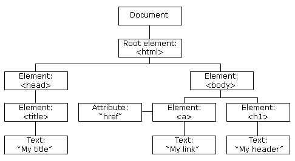

# DOM - Document Object Model

`DOM` là một tiêu chuẩn do `W3C` `(World Wide Web Consortium)` định nghĩa, dùng để biểu diễn cấu trúc của một trang web dưới dạng cây các đối tượng (object).

Nói cách khác:
`DOM` biến toàn bộ nội dung `HTML` thành một cây các đối tượng mà `JavaScript` có thể truy cập và thay đổi.



## DOM gồm 3 thành phần chính
- `Element` (`node` - nút): Mỗi phần tử `HTML` là một `element` `(node)` (ví dụ: thẻ `<p>`, `<div>`, `văn bản`, `comment`...)

- `Attribute` (thuộc tính): Là các thuộc tính của phần tử `HTML` như `id`, `class`, `src`, `style`...

- `Text`: Đại diện cho nội dung chữ nằm giữa thẻ mở và đóng `HTML`.'
```html
<p id="demo" class="pragraph">Xin chào!</p>
<!-- 
  <p></p> là Element 
  id, class là Attribute
  Xin chào! là Text
--> 
```

## Element - Thẻ HTML - phần tử
- Đại diện cho các thẻ `HTML` như `<h1>`, `<p>`, `<div>`, ``, v.v.
- Mỗi phần tử `HTML` sẽ được trình duyệt "dịch" thành một đối tượng `JavaScript` để bạn có thể truy cập và thao tác.

```html
<h1 id="title">Lập trình JavaScript Nâng cao</h1>

<p class="paragraph">JavaScript là ngôn ngữ lập</p>
<p class="paragraph">Nó có thể tính toán, xử lý và xác thực dữ liệu</p>
<p class="paragraph">Nó có thể cập nhật và thay đổi cả HTML và CSS.</p>
```

### Cách lấy phần tử (Truy cập Element)
- id, class, tag
- css selector

```js
// id
let element = document.getElementById("title");

// class
let listClass = document.getElementsByClassName("paragraph");

// tag
var listTag = document.getElementsByTagName('p');
```

```js
// css selector

// id (#)
var element = document.querySelector('#title');

// class (.)
var element = document.querySelector('.paragraph');

// tag
var element = document.querySelector('h1');

// querySelectorAll
var paras = document.querySelectorAll('.paragraph');
```

### Cách thêm phần tử mới
- Dùng `createElement` và `appendChild`
```js
let newP = document.createElement("p"); // tạo phần tử mới
newP.textContent = "Nội dung thêm mới";
document.body.appendChild(newP); // thêm vào cuối body
```

### Cách xóa phần tử
- Dùng `removeChild()`
```js
let parent = document.getElementById("container");
let child = document.getElementById("info");
parent.removeChild(child);
```
- Dùng `element.remove()` (cách ngắn gọn hơn, trình duyệt mới)
```js
document.getElementById("info").remove();
```

### Bài tập
Tạo một trang HTML đơn giản như sau:

```html
<!DOCTYPE html>
<html lang="vi">
<head>
  <meta charset="UTF-8">
  <title>Bài tập DOM</title>
</head>
<body>
  <h1>Danh sách học viên</h1>

  <ul id="student-list">
    <li>Nguyễn Văn A</li>
    <li>Trần Thị B</li>
  </ul>

  <input type="text" id="student-name" placeholder="Nhập tên học viên mới">
  <button onclick="addStudent()">Thêm học viên</button>
  <button onclick="removeLastStudent()">Xoá học viên cuối cùng</button>

  <script src="script.js"></script>
</body>
</html>
```
Yêu cầu:
- Lấy danh sách học viên.
- Thêm học viên mới khi nhấn nút "Thêm học viên".
> Gợi ý lấy giá trị trong ô input thông qua thuộc tính `.value`
> Nâng cao (Cộng điểm): Khi thêm Kiểm tra trùng tên trước khi thêm mới
- Xoá học viên cuối cùng trong danh sách.

---
Còn tiếp Lesson 5
