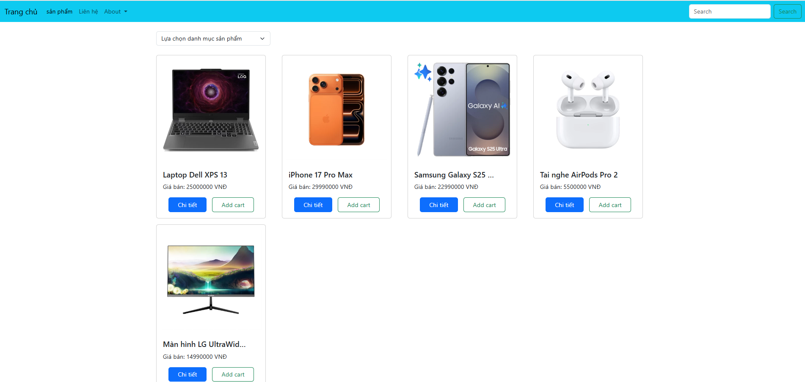

# Thực hành làm việc và xử lý bất đồng bộ

## Cài đặt json-server
1. Cài đặt `NodeJS`
Link cài đặt: https://nodejs.org/en/download

>`Node.js` là một môi trường chạy `JavaScript` ngoài trình duyệt, giúp bạn dùng `JavaScript` để viết ứng dụng phía máy chủ `(server)`.
> Kiểm tra `cmd`: `node -v`

2. Cài đặt `Json-server`
Cài đặt, Mở `cmd` : `npm install -g json-server` 

> `json-server` giúp bạn giả lập một `API RESTful` hoàn chỉnh chỉ từ 1 file `db.json`
> `npm` là viết tắt của `Node Package Manager` – hệ thống quản lý thư viện (`package`) dành cho `JavaScript`, được cài sẵn khi cài `Node.js`.
> Kiểm tra `cmd`: `json-server -v`

3. Tạo dự án phía `server` sử dụng `json-server`
- Tại thư mục của dự án, Mở `termial` trên `visual studio code`: `npm init` và làm theo hướng dẫn hoặc `npm init -y`
- Tạo file `db.json` và thêm nội dung:
```json
{
  "products" : [
    {
      "id": 1,
      "name": "Laptop Dell XPS 13",
      "price": 25000000,
      "category": "Laptop",
      "stock": 10,
      "status": true,
      "image": "https://cdn.hoanghamobile.vn/i/previewV2/Uploads/2024/11/06/loq-15arp9-83jc003yvn-1.png"
    },
    {
      "id": 2,
      "name": "iPhone 17 Pro Max",
      "price": 29990000,
      "category": "Điện thoại",
      "stock": 0,
      "status": false,
      "image": "https://cdn.hoanghamobile.vn/i/previewV2/Uploads/2025/09/10/iphone-17-pro-max-cosmic-orange-pdp-image-position-1-cosmic-orange-color-vn-vi.jpg"
    },
    {
      "id": 3,
      "name": "Samsung Galaxy S25 Ultra",
      "price": 22990000,
      "category": "Điện thoại",
      "stock": 8,
      "status": true,
      "image": "https://cdn.hoanghamobile.vn/i/previewV2/Uploads/2025/01/23/galaxy-s25-ultra-titan-silver-blue-1-8225f9e1f4.png"
    },
    {
      "id": 4,
      "name": "Tai nghe AirPods Pro 2",
      "price": 5500000,
      "category": "Phụ kiện",
      "stock": 20,
      "status": true,
      "image": "https://cdn.hoanghamobile.vn/i/previewV2/Uploads/2023/10/27/airpods-pro-2nd-gen-usb-c-1.png"
    },
    {
      "id": 5,
      "name": "Màn hình LG UltraWide 34 inch",
      "price": 14990000,
      "category": "Màn hình",
      "stock": 0,
      "status": false,
      "image": "https://cdn.hoanghamobile.vn/i/previewV2/Uploads/2025/02/05/egm27f180pv-1.jpg"
    }
  ]
}
```

4. Tại file `package.json`, thêm nội dung cho `scripts`:
```json
"scripts" : {
  "start" : "json-server db.json --watch"
}
```

5. Tại `terminal`, vị trí của dự án, chạy câu lệnh `npm start` để khởi chạy `json-server`.

## Sử dụng Bootstrapt
`Bootstrap` là một `framework` `CSS` (và `JS`) mã nguồn mở, giúp thiết kế giao diện `website` nhanh, đẹp và phản hồi tốt trên mọi thiết bị.

1. Cài đặt sử dụng CDN, chèn đoạn mã sau vào trong phần `<head>`
```html
<link href="https://cdn.jsdelivr.net/npm/bootstrap@5.3.8/dist/css/bootstrap.min.css" rel="stylesheet" integrity="sha384-sRIl4kxILFvY47J16cr9ZwB07vP4J8+LH7qKQnuqkuIAvNWLzeN8tE5YBujZqJLB" crossorigin="anonymous">
<script src="https://cdn.jsdelivr.net/npm/bootstrap@5.3.8/dist/js/bootstrap.bundle.min.js" integrity="sha384-FKyoEForCGlyvwx9Hj09JcYn3nv7wiPVlz7YYwJrWVcXK/BmnVDxM+D2scQbITxI" crossorigin="anonymous"></script>
```

2. Cài đặt extension `Bootstrap IntelliSense` cho `visual studio code`

3. Các thành phần cơ bản trong `Bootstrap`

### Căn chỉnh văn bản
- Vị trí

| Class            | Ý nghĩa          |
| ---------------- | ---------------- |
| `text-start`     | Căn trái         |
| `text-center`    | Căn giữa         |
| `text-end`       | Căn phải         |

- Dáng chữ

| Class             | Ý nghĩa                |
| ----------------- | ---------------------- |
| `text-lowercase`  | Viết thường toàn bộ    |
| `text-uppercase`  | Viết hoa toàn bộ       |
| `text-capitalize` | Viết hoa chữ cái đầu   |

- Kiểu chữ

| Class                          | Ý nghĩa        |
| ------------------------------ | -------------- |
| `fw-bold`                      | Chữ đậm        |
| `fst-italic`                   | In nghiêng     |
| `text-decoration-underline`    | Gạch chân      |
| `text-decoration-line-through` | Gạch ngang chữ |

- Kích thức

| Class   | Ý nghĩa              |
| ------- | -------------------- |
| `fs-1`  | Size 1 (lớn nhất)    |
| `fs-2`  | Size 2               |
| `fs-3`  | Size 3               |
| `fs-4`  | Size 4               |
| `fs-5`  | Size 5               |
| `fs-6`  | Size 6 (nhỏ nhất)    |

### Màu sắc
- Màu chữ: `text-*`
```html
<p class="text-primary">Chữ xanh</p>
<p class="text-danger">Chữ đỏ</p>
```

-Màu nền: `bg-*`
```html
<div class="bg-warning text-dark">Nền vàng</div>
```
> Các giá trị phổ biến: `primary`, `secondary`, `success`, `danger`, `warning`, `info`, `light`, `dark`, `white`

### Khoảng cách - spacing

`Margin` (m) và `Padding` (p):
| Thuộc tính | Ý nghĩa                 | Thuộc tính | Ý nghĩa                 |
| ---------- | ----------------------- | ---------- | ----------------------- |
| `m-*`      | margin tất cả các phía  | `p-*`      | padding tất cả các phía |
| `mt-*`     | margin-top              | `pt-*`     | padding-top             |
| `mb-*`     | margin-bottom           | `pb-*`     | padding-bottom          | 
| `ms-*`     | margin-left (start)     | `ps-*`     | padding-left (start)    |
| `me-*`     | margin-right (end)      | `pe-*`     | padding-right (end)     |
| `mx-*`     | margin-left-right       | `px-*`     | padding-left-right      |
| `my-*`     | margin-top-bottom       | `py-*`     | padding-top-bottom      |

`$space` : 0 - 5, `auto`
> `auto` chỉ dành cho `margin`

- 1 `$space` = `16px`;

| Đơn vị  | Hệ số | ĐƠn vị (px)           |
| ------- | ----- |---------------------- |
| `0`     |  `0`  | `0` * `16` = `0px`    |
| `1`     | `0.25`| `0.25` * `16` = `4px` |
| `2`     | `0.5` | `0.5` * `16` = `8px`  |
| `3`     |  `1`  | `1` * `16` = `16px`   |
| `4`     | `1.5` | `1.5` * `16` = `24px` |
| `5`     |  `3`  | `3` * `16` = `48px`   |

```html
<div class="mt-3 mb-2 p-4">...</div>
```
> `mt-3` = `margin-top: 16px`;
> `mb-2` = `margin-bottom: 8px`;
> `p-4` = `padding: 24px`;

### Kích thước chiều rộng và chiều cao
```html
<div class="w-25">25% chiều rộng</div>
<div class="h-100">Chiều cao 100%</div>
```
| Class                                     | Ý nghĩa    |
| ----------------------------------------- | ---------- |
| `w-25`, `w-50`, `w-75`, `w-100`, `w-auto` | Chiều rộng |
| `h-25`, `h-50`, `h-75`, `h-100`, `h-auto` | Chiều cao  |

> 25, 50, 75, 100 tương ứng 25%, 50%, 75%, 100%

### Display
| Class                        | Mô tả                      |
| ---------------------------- | -------------------------- |
| `d-none`                     | Ẩn phần tử                 |
| `d-block`                    | Hiển thị block             |
| `d-inline`, `d-inline-block` | Hiển thị inline            |
| `d-flex`, `d-grid`           | Sử dụng layout flex / grid |

- `d-flex`: là `class` của `Bootstrap` dùng để biến một phần tử thành một `"flex container"`, giúp bạn dễ dàng sắp xếp, căn chỉnh các phần tử con bên trong theo chiều ngang hoặc dọc.

+ Chiều sắp xếp:

| Class         | Mô tả                        |
| ------------- | ---------------------------- |
| `flex-row`    | (Mặc định) sắp xếp **ngang** |
| `flex-column` | Sắp xếp **dọc**              |

+ `Justify Content` – Căn theo trục ngang (main axis)

| Class                     | Mô tả                        |
| ------------------------- | ---------------------------- |
| `justify-content-start`   | Căn trái (mặc định)          |
| `justify-content-center`  | Căn giữa                     |
| `justify-content-end`     | Căn phải                     |
| `justify-content-between` | Dàn đều 2 đầu                |
| `justify-content-around`  | Khoảng cách đều xung quanh   |
| `justify-content-evenly`  | Khoảng cách đều từng phần tử |

+ `Align Items` – Căn theo trục dọc (cross axis)

| Class                 | Mô tả              |
| --------------------- | ------------------ |
| `align-items-start`   | Căn lên trên       |
| `align-items-center`  | Căn giữa chiều cao |
| `align-items-end`     | Căn xuống dưới     |
| `align-items-stretch` | Kéo dãn chiều cao  |

## Bài tập
Tạo dự án có cấu trúc sau
```
lesson10
  |__controllers
    |__home.js
    |__product-detail.js
  |__views
    |__home.html
    |__product-detail.html
  |__db.json
  |__package.json

```
> `views`: thể hiện giao diện qua `html`
> `controllers`: xử lý logic `javascript` cho file `html` tương ứng

Yêu cầu:
- Xây dựng chức năng danh sách sản phẩm qua `json-server` và hiển thị tại `home`

- Thực hiện chức năng tìm kiếm sản phẩm khi nhấn nút `Search`.
- Thực hiện tìm kiếm sản phẩm theo danh mục khi thay đổi lựa chọn trong `select-option`.
- Xây dựng chức năng chi tiết sản phẩm tại `product-detail`:
> Gợi ý:
> - Để chuyển trang, tại thuộc tính `href` của `a`: `product-detail.html?id=1`
> - Nhận giá trị `id` tại `product-detail.html`
```js
const param = new URLSearchParams(window.location.search);
let id = param.get('id');
```
> - Cách lấy thông tin chi tiết sản phẩm 
```js
const response = await fetch(`http://localhost:3000/products/${id}`)
```